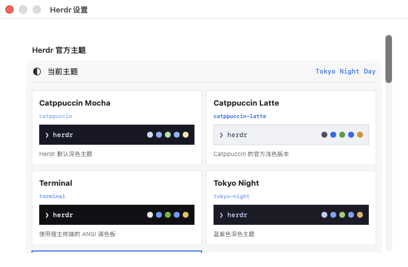

# Herdr Native Clients


一组非官方、开源的 Herdr 原生桌面客户端。macOS 版使用 SwiftUI、AppKit、SwiftTerm 与真实 PTY；Windows Preview 使用 WinUI 3、ConPTY 与随应用离线分发的 xterm.js。两者都直接运行真正的 Herdr TUI，不是日志预览器，也没有重新实现一套会与 Herdr 冲突的 spaces / panes / agents 界面。

> Unofficial native desktop clients for [Herdr](https://herdr.dev/). Herdr itself remains the terminal workspace manager; this project supplies native macOS and Windows windowing, settings, and terminal transport around it.


> 当前截图来自已完成可视验收的 macOS 版；Windows Preview 已通过 Windows runner 的编译、ConPTY 双向交互与打包验证，Windows 实机界面截图将在可视验收后补入。

## 设计原则

Herdr 原有功能不会被 GUI 重做或裁剪。Tabs、末尾 `+`、Spaces、Panes、Agent 状态、Git worktree、通知、插件、集成、Socket API 与持久会话仍由真正的 Herdr TUI 控制；桌面外层只提供原生窗口、会话连接、主题和客户端设置。平台能力严格遵守 Herdr 官方支持边界。

## macOS 功能

- 真实交互式 PTY：键盘、鼠标、ANSI、TrueColor、复制粘贴和全屏 TUI
- 左键直接操作 Herdr 内部 Tab、按钮和对话框
- 普通右键打开 Herdr 官方 Pane/Tab 菜单；`Shift` + 右键打开 macOS 复制、粘贴和查找菜单
- 默认会话、命名会话、`--no-session` 与 SSH Remote Attach
- Remote Attach 支持官方 `--remote-keybindings <local|server>` 与 `--handoff`
- 从指定项目目录启动，支持 SSH config 别名或 `ssh://` 地址
- 18 套与 Herdr 主题名对应的内置配色和即时预览
- 主题写入官方 `~/.config/herdr/config.toml`，其他配置保持不变
- 字体缩放、Option-as-Meta 和可选 Metal GPU 渲染
- 关闭窗口仅 detach，后台 Pane 与 Agent 继续运行

## Windows Preview

- WinUI 3 原生窗口，x64，Windows 10 19041+ / Windows 11
- Windows ConPTY 双向输入输出，运行真实 `herdr.exe`
- xterm.js、FitAddon 与 CSS 全部随 ZIP 离线分发，不访问网页终端服务
- 自动查找 Herdr 官方安装目录、`HERDR_BIN_PATH` 和 `PATH`
- 默认会话、命名会话与指定项目启动目录
- 18 套 Herdr 官方主题名和配色，写入 `%APPDATA%\herdr\config.toml` 并热重载
- 普通右键提供复制、粘贴与重新连接；键盘和 TUI 鼠标事件仍交给 Herdr
- 外层不重复绘制 Herdr 内部 tabs / spaces / panes / agents

Herdr 官方 Windows Preview 目前支持本地持久会话、PowerShell / cmd、spaces、panes、agents、plugins（preview）和 history。官方尚未支持的 Direct terminal attach、`herdr --remote`、live handoff 与 Unix fd handoff，不会伪装成 Windows 客户端功能。详见 [Windows 使用说明](windows/README-WINDOWS.md)。

## 主题设置



## macOS 安装

### 1. 安装 Herdr

请先按 [Herdr 官方文档](https://herdr.dev/docs/quick-start/) 安装并确认终端中可以执行：

```bash
herdr --version
```

### 2. 安装 Mac 客户端

从 [GitHub Releases](https://github.com/0FlowerOcean0/herdr-mac/releases/latest) 下载 `Herdr-for-Mac-0.1.0-arm64.zip`，解压后将 `Herdr.app` 拖入“应用程序”。

当前 Release 使用 ad-hoc 签名，尚未进行 Apple Developer ID 签名与公证。第一次打开时请在 Finder 中按住 Control 点击应用并选择“打开”，或前往“系统设置 → 隐私与安全性”确认打开。

要求：macOS 14+、Apple Silicon、Herdr 0.8.2+。

## Windows Preview 安装

先按 [Herdr 官方 Windows 文档](https://herdr.dev/docs/windows-beta/) 安装 Herdr：

```powershell
powershell -ExecutionPolicy Bypass -c "irm https://herdr.dev/install.ps1 | iex"
```

再从 [GitHub Releases](https://github.com/0FlowerOcean0/herdr-mac/releases) 下载 `Herdr-for-Windows-0.1.0-preview.1-x64.zip`，完整解压后运行 `Herdr.Windows.exe`。Windows ZIP 自带 .NET 与 Windows App SDK 运行文件；系统仍需 Microsoft Edge WebView2 Runtime。

## 从源码构建

需要 Xcode 15+ 和 Swift 5.10+：

```bash
git clone https://github.com/0FlowerOcean0/herdr-mac.git
cd herdr-mac
./scripts/build-app.sh
open dist/Herdr.app
```

开发模式：

```bash
swift run HerdrMac
```

构建可分发压缩包：

```bash
./scripts/package-release.sh
```

产物会写入 `release/`，同时生成 SHA-256 校验文件。

Windows 需要 Windows 10/11、.NET 8 SDK、Node.js 22：

```powershell
.\windows\package-windows.ps1
```

脚本会构建离线终端资源、运行独立 ConPTY 输入/输出 smoke、执行单元测试、发布 self-contained WinUI 3 应用并生成 ZIP 与 SHA-256。

## Herdr 查找顺序

macOS 客户端优先使用 `HERDR_BIN_PATH`，然后检查常见的 Homebrew、`~/.local/bin` 和系统 PATH。实际启动形式包括：

```text
herdr
herdr --session <name>
herdr --remote <ssh-target> [--session <name>] [--remote-keybindings <local|server>] [--handoff]
herdr --no-session
```

Windows 客户端依次检查设置中选择的路径、`HERDR_BIN_PATH`、`%LOCALAPPDATA%\Programs\Herdr\bin\herdr.exe`、`%USERPROFILE%\.herdr\packages\standalone\current\herdr.exe` 与 `PATH`，只启动官方当前支持的本地默认/命名会话。

## 隐私与安全

客户端不会保存模型或 Agent 凭据。终端子进程继承应用环境，并补齐常见命令行工具路径。主题修改只更新 Herdr 官方配置中的主题字段。

## 项目关系与商标

本项目是独立社区项目，并非 Herdr 官方产品，也未获得 Herdr 团队背书。Herdr 名称与 Logo 归其相应权利人所有；使用它们仅用于说明兼容关系。详见 [第三方说明](THIRD_PARTY_NOTICES.md)。

## License

[Apache License 2.0](LICENSE)
